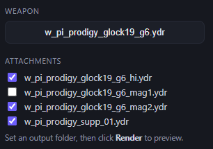

# Qendering

A desktop app for batch-rendering GTA V clothing (`.ydd`) and world objects
(`.ydr`) into clean preview images for FiveM shops, catalogs and admin tools.

It is a full rewrite of an earlier Python tool as a **Tauri 2** app: a **Rust**
core plus a Svelte UI, with the 3D rendering driven through **Blender +
Sollumz**. One file to start, no Python environment to manage.

## Status

Stable and feature-complete. A signed Windows installer (`.exe`) is published on
every release; see the [Releases](https://github.com/qalle-git/qendering/releases)
page for the latest one. After the first install the app **updates itself** — it
checks GitHub on launch and offers to install new versions in place.

## Demo

[qendering.webm](https://github.com/user-attachments/assets/8de23d67-6cd5-4bbe-9940-d8869c93a609)


[Watch the demo](https://github.com/qalle-git/qendering/raw/main/docs/qendering.webm)
if the player does not load.

## Features

- **Three render modes**
  - *Clothing*: a fast, pure-Rust pipeline that pulls the diffuse texture
    straight from each `.ytd` (RSC7 -> YTD -> DDS -> decode -> image). No
    Blender needed. An optional **3D render** toggle instead imports each paired
    `.ydd` drawable in Blender for a true 3D preview.
  - *Objects*: 3/4 product shots of standalone `.ydr` world objects rendered in
    Blender via Sollumz, with external `.ytd` pack textures auto-applied.
  - *Weapons*: pick a weapon (`.ydr`/`.yft`), tick the attachment models sitting
    beside it (scope, suppressor, flashlight, mag), and render one assembled
    still. Attachments snap onto the weapon's `WAP*` skeleton bones, so they land
    in the right place instead of piling at the origin.
- **Output formats**: WebP, PNG, or JPEG. Transparent backgrounds for WebP/PNG;
  JPEG is flattened onto white.
- **Camera controls**: azimuth (0-360 degrees) and elevation (0-60 degrees)
  sliders for object shots.
- **Live turntable preview**: render the first object once, then scrub the
  azimuth slider to rotate it in real time. The frame count is adjustable for
  smoother or faster previews.
- **Spinning GIFs**: optionally render a 2-second 360-degree turntable GIF per
  object instead of a still.
- **Per-pack batch mode**: render each top-level pack folder in its own isolated
  Blender worker pool and output subfolder, so one bad pack cannot crash-storm
  the rest and packs can be uploaded independently.
- **Results gallery**: searchable, lazy-loaded thumbnail grid with arrow-key
  cycling, filename labels, and a one-click clear.
- **Dated / labeled output folders**: optionally write each run into a
  timestamped (and optionally labeled) subfolder.
- **Stop button**: cancel cleanly after the current item.
- **Per-item timeout**: skip any Blender render that hangs longer than the
  chosen number of seconds (the worker restarts so the run keeps going).
- **`manifest.json`**: every run writes a machine-readable index of what it
  produced (see below), for downstream catalogs and CDN-backed browsers.
- **Clean output**: source basenames with `^` rewritten to `_`, automatic
  de-duplication of repeated names, square padded canvas, glass forced opaque,
  and scale-invariant lighting so props of any size light consistently.

### Weapons mode

Pick a weapon and tick the attachment models that sit beside it; each snaps onto
its matching skeleton bone before the shot is rendered.



## Output layout

A normal run writes images into a `textures/` folder next to a `manifest.json`:

```
<output>/
  manifest.json
  textures/
    ch_prop_vault_painting_01b.webp
    ...
```

With **dated subfolders** enabled, that whole structure lands under
`<output>/2026-06-22_19-30-05[_label]/`. With **per-pack batch mode**, each pack
gets its own folder and manifest:

```
<output>/[dated/]prp_housing_props4/manifest.json
<output>/[dated/]prp_housing_props4/textures/*.webp
<output>/[dated/]prp-customprops/manifest.json
<output>/[dated/]prp-customprops/textures/*.webp
```

### `manifest.json`

```json
{
  "mode": "objects",
  "format": "webp",
  "count": 160,
  "props": [
    {
      "name": "ch_prop_vault_painting_01b",
      "file": "ch_prop_vault_painting_01b.webp",
      "source": "prp_housing_props4"
    }
  ]
}
```

`name` is the output basename (and the CDN image name), `file` includes the
extension, and `source` is the top-level pack/DLC folder the model came from.

## Runtime requirements

The Clothing mode is self-contained. The Objects mode renders through Blender,
so that machine also needs:

- **Blender 4.2+ or 5.x** with the **Sollumz** add-on, plus **PyMateria** for
  binary `.ydd` / `.ydr` import. The renderer picks the correct Eevee engine
  automatically (`BLENDER_EEVEE_NEXT` on 4.x, `BLENDER_EEVEE` on 5.x).

Qendering detects Blender automatically: `PATH` first, then the standard Windows
install locations, then a Steam-installed Blender (read from Steam's
`libraryfolders.vdf`, so it is found on any library drive).

## Usage

1. Install Blender + Sollumz (+ PyMateria) if you want object rendering.
2. Download and run the latest release, or build locally (below).
3. Pick an **input folder** (a resource, a `[props]` directory, or a single
   pack) and an **output folder**.
4. Choose **Clothing** or **Objects**, the output **format**, and any options
   (camera angle, animate, dated subfolder, per-pack batch).
5. Click **Render**. Watch progress, browse results in the gallery, and find the
   images plus `manifest.json` in the output folder.

## Development

```bash
npm install
npm run tauri dev      # run the app in dev mode
npm run tauri build    # build a local .exe + installers
```

Rust tests for the core and render crates:

```bash
cd src-tauri && cargo test
```

Some tests are gated behind environment variables (`QENDERING_TEST_YTD`,
`QENDERING_TEST_YDR`, `QENDERING_TEST_SCRIPT`, `QENDERING_TEST_DDS_DIR`) and run
against real game files; they are skipped in CI.

## Architecture

- **`src-tauri/`**: the Tauri app (Rust). Hosts the UI, exposes the render
  commands, and orchestrates runs.
- **`crates/qendering-core/`**: pure-Rust core. RSC7 decode, YTD parsing, DDS
  decode (BC1-7), image resize + WebP/PNG/JPEG encode, GIF assembly, filename
  parsing, and clothing/object discovery.
- **`crates/qendering-render/`**: the Blender bridge. Drives a pool of
  persistent headless Blender workers over a JSON-line protocol, with
  crash-restart and per-item timeouts.
- **`python/blender_render.py`**: the in-Blender render worker. It runs inside
  Blender's embedded interpreter via Sollumz, so it stays Python.
- **`src/`**: the SvelteKit (static) front-end.
- **`.github/workflows/release.yml`**: builds the Windows `.exe` / `.msi` and
  attaches them to a GitHub Release on each `v*` tag.

## Releases

Push a version tag to build and publish the installer:

```bash
git tag v0.7.0 && git push origin v0.7.0
```
